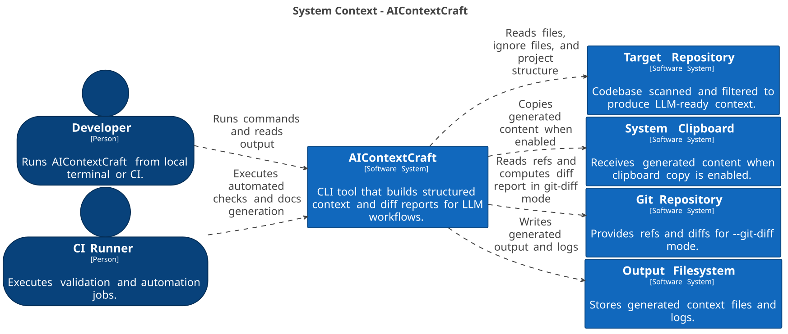
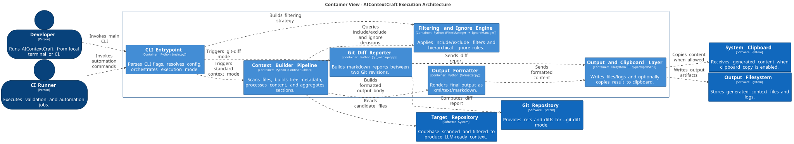
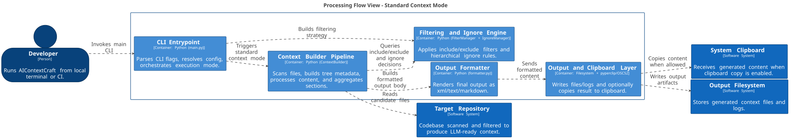
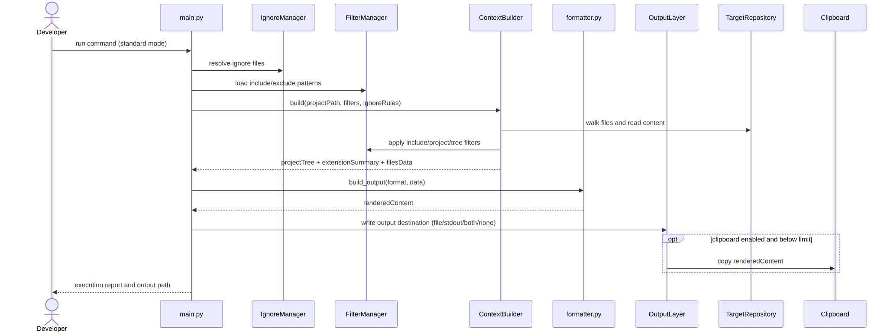
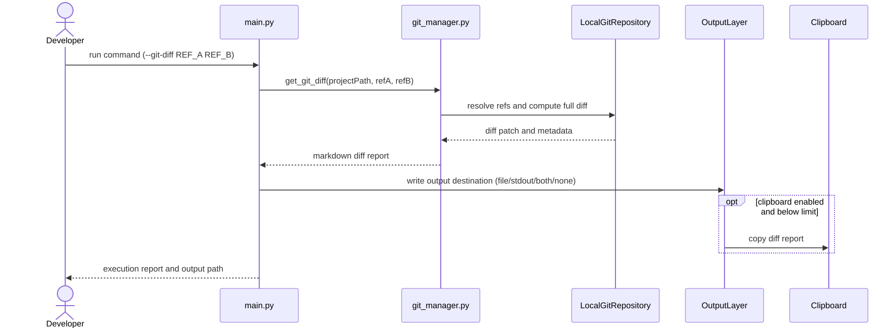

# Architecture Diagrams

This folder centralizes project architecture diagrams in diagrams-as-code form.

## Contents

- `structurizr/workspace.dsl`: reference C4 model (system context + container + processing flow).
- `structurizr/out/`: exports generated by the Structurizr CLI.
- `assets/`: versioned SVG images for documentation.
- `sequences/run-standard-flow.md`: sequence diagram for the standard (concat) workflow.
- `sequences/git-diff-flow.md`: sequence diagram for the `--git-diff` workflow.

## Single regeneration command

From the repository root:

```bash
./scripts/architecture/generate-all.sh
```

## Prerequisites

- Option A: `structurizr` installed locally.
- Option B: `docker` available to run `structurizr/structurizr`.
- For SVG output:
  - local `plantuml` or Docker (`plantuml/plantuml`)
  - local `mmdc` or Docker (`minlag/mermaid-cli`)

## Available scripts

- `scripts/architecture/render-structurizr.sh`
  - Exports the Structurizr model to Structurizr PlantUML under `docs/architecture/structurizr/out`.
- `scripts/architecture/validate-mermaid.sh`
  - Extracts the first Mermaid block from each file in `docs/architecture/sequences` and validates rendering.
- `scripts/architecture/render-diagram-assets.sh`
  - Converts diagrams to versioned SVG under `docs/architecture/assets/`.
- `scripts/architecture/generate-all.sh`
  - Runs export, validation, and asset generation in sequence.

## Update rules

1. Edit `structurizr/workspace.dsl` first for any static architecture change.
2. Update Mermaid sequences when the standard pipeline or `--git-diff` mode changes.
3. Regenerate artifacts with `./scripts/architecture/generate-all.sh`.
4. Verify C4 SVG views exist in `docs/architecture/assets/`:
   - `system-context.svg`
   - `container-view.svg`
   - `processing-flow-view.svg`
5. Verify sequence SVGs exist:
   - `run-standard-flow.svg`
   - `git-diff-flow.svg`

## Published diagram preview

### C4 - System Context


### C4 - Container View


### C4 - Processing Flow View


### Sequence - Run Standard


### Sequence - Git Diff

