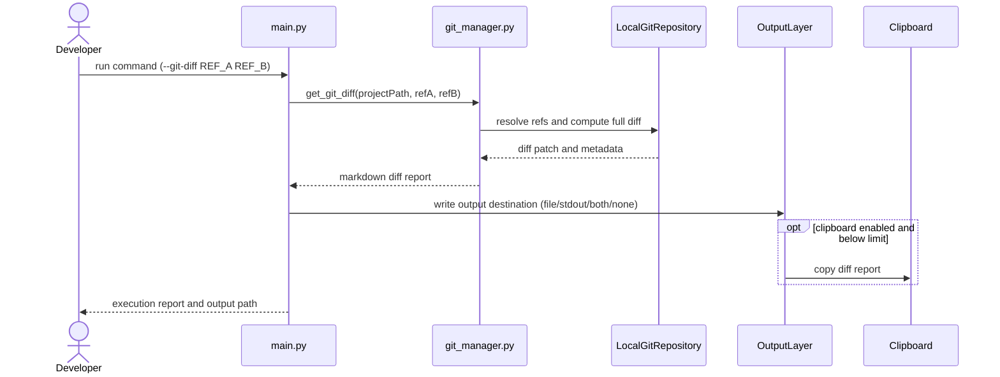

# Git Diff Flow

This sequence diagram describes the dedicated `--git-diff REF_A REF_B` mode.

```mermaid
sequenceDiagram
    actor Developer
    participant CLI as main.py
    participant GitMgr as git_manager.py
    participant GitRepo as LocalGitRepository
    participant IO as OutputLayer
    participant Clip as Clipboard

    Developer->>CLI: run command (--git-diff REF_A REF_B)
    CLI->>GitMgr: get_git_diff(projectPath, refA, refB)
    GitMgr->>GitRepo: resolve refs and compute full diff
    GitRepo-->>GitMgr: diff patch and metadata
    GitMgr-->>CLI: markdown diff report
    CLI->>IO: write output destination (file/stdout/both/none)
    opt clipboard enabled and below limit
        IO->>Clip: copy diff report
    end
    CLI-->>Developer: execution report and output path
```
