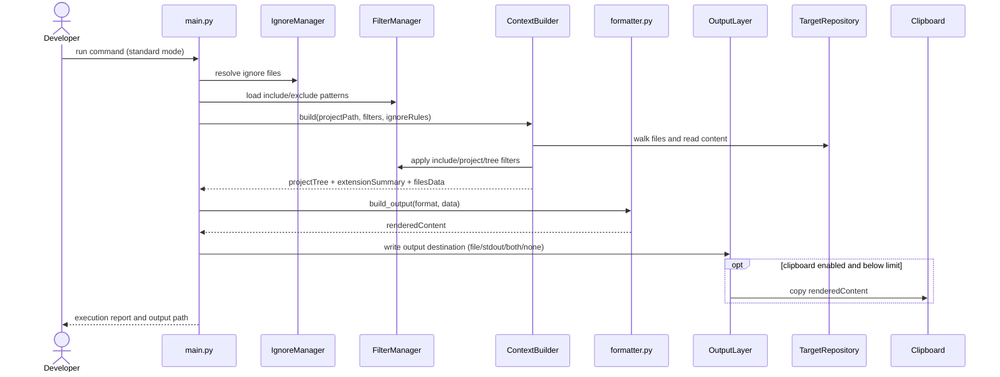

# Run Standard Flow

Ce diagramme de sequence decrit le chemin principal de `python main.py` hors mode `--git-diff`.

```mermaid
sequenceDiagram
    actor Developer
    participant CLI as main.py
    participant Ignore as IgnoreManager
    participant Filter as FilterManager
    participant Builder as ContextBuilder
    participant Formatter as formatter.py
    participant IO as OutputLayer
    participant Repo as TargetRepository
    participant Clip as Clipboard

    Developer->>CLI: run command (standard mode)
    CLI->>Ignore: resolve ignore files
    CLI->>Filter: load include/exclude patterns
    CLI->>Builder: build(projectPath, filters, ignoreRules)
    Builder->>Repo: walk files and read content
    Builder->>Filter: apply include/project/tree filters
    Builder-->>CLI: projectTree + extensionSummary + filesData
    CLI->>Formatter: build_output(format, data)
    Formatter-->>CLI: renderedContent
    CLI->>IO: write output destination (file/stdout/both/none)
    opt clipboard enabled and below limit
        IO->>Clip: copy renderedContent
    end
    CLI-->>Developer: execution report and output path
```
