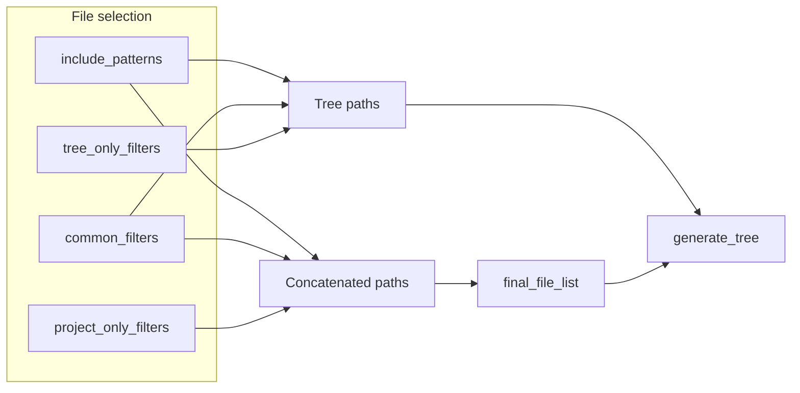

# Enriched tree: sizes, extensions, and visual indicators

## Current context

- The tree is produced by [`craft/tree_generator.py`](craft/tree_generator.py) via `generate_tree(directory, include_spec, tree_exclude_spec, show_sizes=False)`.
- Sizes display only with `--tree-only` (`show_sizes=args.tree_only` in [`main.py`](main.py) line 166).
- Two distinct filter sets already exist:
  - **Tree**: `common_filters` + `tree_only_filters` → `tree_exclude_spec`
  - **Concatenation**: `common_filters` + `project_only_filters` → `project_exclude_spec`
- A file can therefore be **indicative** (visible in the tree via `project_only_filters`) or **concatenated** (present in `final_file_list`).



## Target behavior

### Introductory sentence (before the tree)

English explanatory block placed **just before** `Project tree: ...`, explaining:

- `●` = file **actually concatenated** (content / `project` filters)
- `○` = **indicative** file (tree only, excluded by `project_only_filters`)
- Size on a `●` file = on-disk size of the concatenated file; no size on `○`
- Folder size = sum of `●` files under that folder, then `(Real total: …)` = sum of **all** files visible in the tree under that folder
- Extensions section: same logic (concatenated total per extension, then real total of files visible in the tree)

### Tree line format

| Element | Proposed format |
|---------|----------------|
| Concatenated file | `├── ● main.py — 1.23 KB` |
| Indicative file | `├── ○ README.md` (no size) |
| Folder | `├── craft/ — 12.45 KB (Real total: 18.90 KB)` |
| Empty folder (structure only) | `├── build/` (no size suffix if both totals are 0 bytes) |

- Reuse [`format_bytes`](craft/utils.py) for consistency with global stats.
- Use ` — ` separator between name and size for readability.

### Extensions section (after tree, before `FILE CONTENTS`)

```
Extensions (concatenated files):
  .py      45.20 KB (Real total: 52.10 KB)
  .yaml     1.20 KB (Real total:  3.40 KB)
  (no extension)   0 B (Real total: 512 B)
```

- **Include**: all extensions present in `final_file_list` (concatenation).
- **Concatenated total**: sum of on-disk sizes of concatenated files for that extension.
- **Real total**: sum of on-disk sizes of all files **visible in the tree** with that extension (concatenated + indicative).
- Sort extensions alphabetically; empty extension → label `(no extension)`.

### `--tree-only` mode

- Keep current behavior (no content reading).
- Apply the **same** enriched tree + extensions section (sizes no longer tied to `show_sizes` from `--tree-only`).

## Technical changes

### 1. Reorder flow in [`main.py`](main.py)

Today the tree is generated **before** `final_file_list`. Reverse:

1. Build `final_file_list` (existing `os.walk` logic, lines 171–188).
2. Call `generate_tree` with the set of concatenated paths:

```python
concatenated_paths = set(final_file_list)
project_tree = generate_tree(
    project_path,
    include_spec,
    tree_exclude_spec,
    concatenated_paths=concatenated_paths,
)
```

3. Assemble output: `intro + project_tree + extension_block + content`.

### 2. Refactor [`craft/tree_generator.py`](craft/tree_generator.py)

**New signature** (replace `show_sizes`):

```python
def generate_tree(
    directory: Path,
    include_spec,
    exclude_spec,
    concatenated_paths: set[Path],
) -> str
```

**Algorithm**:

1. Collection phase (unchanged): `paths_for_tree` + parent walk-up → `final_paths_for_tree`.
2. Metrics phase: for each file in `final_paths_for_tree`:
   - `real_size = path.stat().st_size` (with `OSError` guard)
   - `concat_size = real_size` if `path in concatenated_paths` else `0`
3. Folder aggregation: walk paths deepest-first; for each directory, sum descendant file `concat_size` and `real_size`.
4. Render phase: existing tree lines + symbol + size suffix per rules above.
5. Return structure or string including intro + tree; **or** expose:
   - `build_tree_legend() -> str`
   - `generate_tree(...) -> str`
   - `format_extension_summary(tree_files, concatenated_paths) -> str`

Extract pure helpers in the same module (easier unit tests):

- `_file_sizes(path) -> int`
- `_aggregate_dir_sizes(paths, concatenated_paths) -> dict[Path, tuple[int, int]]`
- `format_extension_summary(directory, tree_file_paths, concatenated_paths) -> str`

### 3. Intro and assembly

In `generate_tree` or dedicated `build_project_tree_section(...)`:

```text
{legend_paragraph}

Project tree: {resolved_path}
├── ...
```

Then in `main.py`:

```python
extension_summary = format_extension_summary(project_path, tree_paths, concatenated_paths)
full_body = (
    project_tree + "\n\n" + extension_summary + "\n\n"
    + separator + "\nFILE CONTENTS\n" + ...
)
```

### 4. Tests

| File | Action |
|---------|--------|
| New `tests/test_tree_generator.py` | Unit tests: folder aggregation, symbols, extensions, `○` files without size |
| New `tests/test_projects/tree_stats_project/` | Minimal project: `app/main.py` (concatenated), `README.md` via `project_only_filters` (indicative), `config.yaml` |
| [`tests/test_projects/basic_project/expected_output.txt`](tests/test_projects/basic_project/expected_output.txt) | Regenerate via targeted run (all test files concatenated → only `●`) |
| [`tests/test_aicc.py`](tests/test_aicc.py) | Verify `find_content_start` on `"Project tree:"` remains valid; add `test_tree_stats_project` asserting `●`, `○`, `(Real total`, `Extensions` section |

Post-implementation validation (project rule):

```bash
.aicc_venv/bin/python -m pytest tests
```

### 5. Light documentation

- Update `--tree-only` help in [`main.py`](main.py) (tree now shows sizes by default, not only in tree-only mode).
- Optional: one sentence in [`README.md`](README.md) “Project Tree” section on ●/○ markers.

## Plan publication

On execution, after plan validation:

- Copy the validated plan to `docs/plans/` as `YYYY_MM_DD_HH-MM_refactor__phase-0_arbre-tailles-extensions.plan.md` (timestamp at copy time, kebab-case title).

## Main impacted files

- [`craft/tree_generator.py`](craft/tree_generator.py) — core feature
- [`main.py`](main.py) — execution order, output assembly
- [`craft/utils.py`](craft/utils.py) — reuse `format_bytes` (import from tree_generator)
- Tests: new module + project fixture + `expected_output.txt` update

## Expected render sample (excerpt)

```text
Legend: ● file concatenated in the content below; ○ file shown for reference only (excluded by project_only_filters). Folder and extension sizes show concatenated ● totals first, then (Real total: …) for all files visible in the tree.

Project tree: /opt/AIContextCraft
├── ○ README.md
├── ● main.py — 8.12 KB
├── craft/ — 24.50 KB (Real total: 28.00 KB)
│   ├── ● tree_generator.py — 3.21 KB
│   └── ○ utils.py
...

Extensions (concatenated files):
  .py    24.50 KB (Real total: 28.00 KB)
```

---

## Implementation report

### Changes delivered

- **`craft/tree_generator.py`**: full refactor — legend (`build_tree_legend`), `●`/`○` symbols, concatenated vs real size aggregation per folder, `format_extension_summary()`, new `generate_tree(..., concatenated_paths)` returning `(tree, paths)`.
- **`main.py`**: `final_file_list` computed before tree; `concatenated_paths` passed to `generate_tree`; assembly `tree + extensions + content`; updated `--tree-only` help.
- **Tests**: `tests/test_tree_generator.py` (5 unit tests), fixture `tests/test_projects/tree_stats_project/`, `test_tree_stats_project_indicators` in `test_aicc.py`, `basic_project` `expected_output.txt` regenerated.
- **Documentation**: sentence added in `README.md` on tree markers.

### Modified / created files

| File | Action |
|---------|--------|
| `craft/tree_generator.py` | Rewritten |
| `main.py` | Modified |
| `tests/test_tree_generator.py` | Created |
| `tests/test_projects/tree_stats_project/` | Created (config, app/main.py, README.md, mixed/) |
| `tests/test_aicc.py` | Modified |
| `tests/test_projects/basic_project/expected_output.txt` | Updated |
| `README.md` | Updated |
| `docs/plans/2026_05_17_16-43_refactor__phase-0_arbre-tailles-extensions.plan.md` | Plan published |

### Validation

```bash
.aicc_venv/bin/python -m pytest tests
```

- **12 tests collected**, all **passed**
- **20 warnings** (`gitwildmatch` deprecation in pathspec, no functional impact)

### Delivered behavior

- Explanatory legend before the tree.
- `●` files with size; `○` files without size.
- Folders: concatenated total, then `(Real total: …)` when different.
- `Extensions (concatenated files)` section after tree, before content.
- `--tree-only` mode: same enriched tree, no file content reading.
