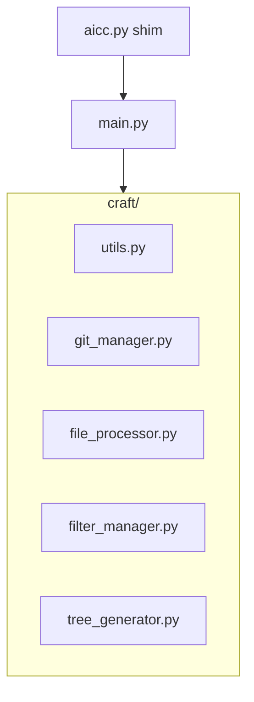

# Phase 0 — Modular refactoring (foundation)

## Objective

Move from a monolithic script ([`aicc.py`](/opt/AIContextCraft/aicc.py), ~509 lines) to a modular architecture in the [`craft/`](/opt/AIContextCraft/craft/) package, **without changing functional behavior** (behavior-preserving refactor).

Constraints for this phase:

- Preserve all existing CLI options, including `--git-diff` (Markdown Git diff report between two revisions).
- Preserve `os.walk` optimizations with pruning of excluded directories (tree and file traversal).
- Maintain **two equivalent entry points**: `main.py` (canonical) and `aicc.py` (compatibility).
- Clean unused imports (`io`, `tokenize` currently dead in `aicc.py`).
- Keep all **6 tests** in [`tests/test_aicc.py`](/opt/AIContextCraft/tests/test_aicc.py) passing.

Target branch: `refactor/phase-0`.

---

## Plan location

This plan lives in the repo at:

[`docs/plans/2026_05_17_16:00_refactor__phase-0_phase-0-refactoring.plan.md`](/opt/AIContextCraft/docs/plans/2026_05_17_16:00_refactor__phase-0_phase-0-refactoring.plan.md)

---

## Target architecture

```text
/opt/AIContextCraft/
├── main.py                 # Canonical entry point (orchestrator)
├── aicc.py                 # Compatibility entry point (delegates to main)
├── config.yaml
├── craft/
│   ├── __init__.py
│   ├── utils.py            # logging, stats, format_bytes
│   ├── git_manager.py      # get_git_diff
│   ├── file_processor.py   # strip_comments, get_python_headers
│   ├── filter_manager.py   # normalize_glob_patterns
│   └── tree_generator.py # generate_tree
├── README.md               # documents main.py and aicc.py
└── tests/
    ├── test_aicc.py        # subprocess via main.py
    └── setup_tests.sh      # same
```



---

## Responsibility split

### [`craft/utils.py`](/opt/AIContextCraft/craft/utils.py)

- `TIKTOKEN_AVAILABLE` + optional `tiktoken` import
- `setup_logging(log_file_path, verbose)`
- `format_bytes(size)`
- `get_file_stats(content_str, encoding='utf-8')`

### [`craft/git_manager.py`](/opt/AIContextCraft/craft/git_manager.py)

- `get_git_diff(repo_path, ref_a, ref_b)` — verifies Git repo, runs `git diff`, raises errors (`RuntimeError`) with unchanged messages.

### [`craft/file_processor.py`](/opt/AIContextCraft/craft/file_processor.py)

- `strip_comments_from_code(content, file_path)` — Python AST, shell/Dockerfile.
- `get_python_headers(content, full_body_filters_patterns)` — signatures + partial docstrings.

Imports: `ast`, `pathlib.Path`, `fnmatch`, `logging` only.

### [`craft/filter_manager.py`](/opt/AIContextCraft/craft/filter_manager.py)

- `normalize_glob_patterns(patterns)` — `\` → `/` normalization for cross-platform matching.

### [`craft/tree_generator.py`](/opt/AIContextCraft/craft/tree_generator.py)

- `generate_tree(directory, include_spec, exclude_spec, show_sizes=False)` — tree with `os.walk` pruning.

### [`main.py`](/opt/AIContextCraft/main.py)

Single orchestrator. Contains `main()` and:

- `argparse` parsing (all current options);
- YAML load/merge + YAML error messages (backslash help);
- `--git-diff` branch (`.txt` → `.md`, stats, dry-run);
- filter assembly (`clean_patterns`, `pathspec`, `.gitignore`);
- `os.walk` loop to list files;
- read, transform (`strip-comments`, `headers-only`), write output.

**Do not move** in this phase: full configuration logic, advanced filter assembly (see “Deferred”).

### [`aicc.py`](/opt/AIContextCraft/aicc.py) — compatibility

Minimal file (~5 lines), no business logic:

```python
"""Compatibility entry point. Delegates to main.main()."""
from main import main

if __name__ == "__main__":
    main()
```

Existing scripts, habits, and docs that invoke `python aicc.py` keep working.

---

## Implementation steps

### 1. Publish the plan

Copy this file into `docs/plans/` with the timestamped name above.

### 2. Create `craft/`

- `craft/__init__.py` (empty package or explicit exports).

### 3. Extract modules (leaves → root)

`utils` → `git_manager` → `file_processor` → `filter_manager` → `tree_generator`.

Each module imports only what it actually uses.

### 4. Create `main.py`

- Migrate `main()` from `aicc.py`, replacing extracted functions with `from craft... import ...`.
- Preserve line-by-line: messages, flow, exit codes, generated file formats.

### 5. Create the `aicc.py` shim

- Replace the current monolith with delegation to `main.main()` (see snippet above).

### 6. Clean unused imports

- Remove `io` and `tokenize` (never used in the current monolith).
- Check each `craft/*.py` and `main.py`: no orphan imports after extraction.
- Do not add new dependencies.

### 7. Update README

In [`README.md`](/opt/AIContextCraft/README.md):

- Present **`python main.py`** as the primary command.
- State that **`python aicc.py`** remains supported (compatibility alias, same behavior).
- Update all examples (Usage, Example Workflow, CLI table if applicable).

### 8. Update tests and test scripts

| File | Change |
|---|---|
| [`tests/test_aicc.py`](/opt/AIContextCraft/tests/test_aicc.py) | `AICC_SCRIPT = PROJECT_ROOT / 'main.py'` (canonical entry for pytest) |
| [`tests/setup_tests.sh`](/opt/AIContextCraft/tests/setup_tests.sh) | `AICC_SCRIPT="$PROJECT_ROOT/main.py"` |

**Do not modify**: `tests/test_projects/**` (golden files).

**Supplementary manual check** (outside pytest): run an identical command via `python aicc.py` and `python main.py` on `basic_project`; outputs must match.

### 9. Non-regression

```bash
cd /opt/AIContextCraft
.aicc_venv/bin/python -m pytest tests/test_aicc.py -v
```

Criterion: **6/6** tests pass.

### 10. Post-implementation

1. Implementation report in chat (modified files, test results).
2. Ask whether the report should be appended to the plan (`---` + `## Implementation report`).
3. Propose a Conventional Commits message.

---

## Strict rules

- **Zero new features**: no tqdm, clipboard, YAML profiles, etc.
- **Zero output change**: same generated files, headers, diffs, logs, return codes.
- **Minimal imports** per module after cleanup.
- **Two entries, one behavior**: `aicc.py` and `main.py` must produce identical results.

---

## Validation

| Check | Method |
|---|---|
| Automated tests | `pytest tests/test_aicc.py` → 6 tests OK |
| `aicc.py` compatibility | manual smoke test or one-liner on both entries |
| README | examples consistent with `main.py` + `aicc.py` mention |
| Imports | no residual `io` / `tokenize` |

---

## Deferred to later phases

Items intentionally **out of scope** for Phase 0. This refactor prepares the ground without implementing them.

### `craft/config_manager.py` — centralized configuration

**Target capability:** dedicated module for YAML loading (`config.yaml` or `-c`), merge with defaults, schema validation, and structured error messages (including backslash help).

**Why deferred:** this logic currently lives in `main()` (~40 lines). Extracting it now would multiply regression risk on cases already covered by tests (invalid config, special patterns) without immediate user value. Phase 0 focuses on splitting *business* code (files, filters, tree, git). `config_manager` comes when the modular base is stable.

### Extended `craft/filter_manager.py` — full filter assembly

**Target capability:** centralize `clean_patterns`, merge `common_filters` / `project_only_filters` / `tree_only_filters`, `.gitignore` integration, `PathSpec` creation, and automatic exclusion of the output file.

**Why deferred:** only `normalize_glob_patterns` is isolated in Phase 0 as a coherent, indirectly tested unit. The rest is tightly coupled to `main()` and `pathspec`; moving it in the same refactor would increase change surface without dedicated unit tests yet.

### Per-module unit tests

**Target capability:** focused tests on `file_processor`, `tree_generator`, etc., in addition to current subprocess E2E tests.

**Why deferred:** Phase 0 priority is non-regression on the 6 existing integration tests. Unit tests become relevant once modules are extracted and stable.

### Product features (ROADMAP Phase 1+)

Deferred because they are **new capabilities**, not refactoring:

| Item | Short description | Suggested phase |
|---|---|---|
| Progress bar (`tqdm`) | Visual feedback during concatenation | Phase 1 (UX) |
| `--clipboard` | Copy output to clipboard | Phase 1 (UX) |
| Robust encodings (`chardet`) | Replace silent `errors='ignore'` | Phase 1 |
| Multi-language `strip-comments` | JS, TS, HTML, etc. | Phase 2 |
| Configuration profiles | `--profile frontend` | Phase 2 |
| `--max-tokens` splitting | Multiple output files | Phase 2 |
| Selective `--git-diff` (changed files) | Diff + filter impacted files (distinct from current global report mode) | Phase 3 |
| Smart token prioritization | Heuristics under size constraints | Phase 3 |

---

## Suggested commit (indicative)

```
refactor(craft): modularize aicc into craft package and main.py

Extract utils, git, file processing, filters, and tree generation.
Keep aicc.py as compatibility shim. Clean dead imports. Update README
and tests. Preserve --git-diff and all CLI behavior.

Plan: docs/plans/2026_05_17_16:00_refactor__phase-0_phase-0-refactoring.plan.md
```


---
## Implementation report
### Delivered architecture
- Package `craft/`: `__init__.py`, `utils.py`, `git_manager.py`, `file_processor.py`, `filter_manager.py`, `tree_generator.py`
- `main.py`: orchestrator (argparse, YAML, filters, `os.walk`, output)
- `aicc.py`: compatibility shim delegating to `main.main()`
### Modified / created files
| File | Action |
|---------|--------|
| `craft/*.py` | Created (6 modules) |
| `main.py` | Created |
| `aicc.py` | Replaced with shim (~5 lines) |
| `tests/test_aicc.py` | `AICC_SCRIPT` → `main.py` |
| `tests/setup_tests.sh` | `AICC_SCRIPT` → `main.py` |
| `README.md` | `main.py` primary + `aicc.py` alias note |
| `docs/plans/2026_05_17_16:00_refactor__phase-0_phase-0-refactoring.plan.md` | Plan published |
Dead imports `io` and `tokenize` removed (not present in final modules).
### Validation
- **pytest**: 6/6 passed (`tests/test_aicc.py`, ~1.37 s, no warnings)
- **Smoke test**: identical output between `python main.py` and `python aicc.py` on `basic_project` (`diff` OK)
### Verification command
```bash
cd /opt/AIContextCraft
.aicc_venv/bin/python -m pytest tests/test_aicc.py -v

```
