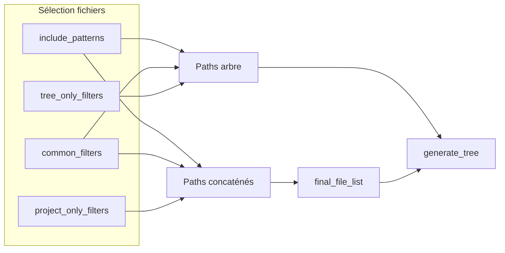

# Arbre enrichi : tailles, extensions et indicateurs visuels

## Contexte actuel

- L'arbre est produit par [`craft/tree_generator.py`](craft/tree_generator.py) via `generate_tree(directory, include_spec, tree_exclude_spec, show_sizes=False)`.
- Les tailles ne s'affichent qu'avec `--tree-only` (`show_sizes=args.tree_only` dans [`main.py`](main.py) ligne 166).
- Deux jeux de filtres distincts existent déjà :
  - **Arbre** : `common_filters` + `tree_only_filters` → `tree_exclude_spec`
  - **Concaténation** : `common_filters` + `project_only_filters` → `project_exclude_spec`
- Un fichier peut donc être **indicatif** (visible dans l'arbre via `project_only_filters`) ou **concaténé** (présent dans `final_file_list`).



## Comportement cible

### Phrase introductive (avant l'arbre)

Bloc de texte en français, placé **juste avant** `Arbre du projet : ...`, qui explique :

- `●` = fichier **réellement concaténé** (filtres contenu / `project`)
- `○` = fichier **indicatif** (présent dans l'arbre uniquement, exclu par `project_only_filters`)
- Taille affichée sur un fichier `●` = taille disque du fichier concaténé ; pas de taille sur les `○`
- Taille d'un dossier = somme des fichiers `●` sous ce dossier, puis `(Total réel : …)` = somme de **tous** les fichiers visibles dans l'arbre sous ce dossier
- Section extensions : même logique (total concaténé par extension, puis total réel des fichiers visibles dans l'arbre)

### Format des lignes de l'arbre

| Élément | Format proposé |
|---------|----------------|
| Fichier concaténé | `├── ● main.py — 1.23 KB` |
| Fichier indicatif | `├── ○ README.md` (pas de taille) |
| Dossier | `├── craft/ — 12.45 KB (Total réel : 18.90 KB)` |
| Dossier vide (arborescence) | `├── build/` (sans suffixe taille si 0 octet des deux côtés) |

- Réutiliser [`format_bytes`](craft/utils.py) pour un formatage cohérent avec les stats globales.
- Séparateur ` — ` entre nom et taille pour la lisibilité.

### Section extensions (après l'arbre, avant `CONTENU DES FICHIERS`)

```
Extensions (fichiers concaténés) :
  .py      45.20 KB (Total réel : 52.10 KB)
  .yaml     1.20 KB (Total réel :  3.40 KB)
  (sans extension)   0 B (Total réel : 512 B)
```

- **Inclure** : toutes les extensions présentes dans `final_file_list` (concaténation).
- **Total concaténé** : somme des tailles disque des fichiers concaténés de cette extension.
- **Total réel** : somme des tailles disque de tous les fichiers **visibles dans l'arbre** ayant cette extension (concaténés + indicatifs).
- Tri alphabétique des extensions ; extension vide → libellé `(sans extension)`.

### Mode `--tree-only`

- Conserver le comportement actuel (pas de lecture de contenu).
- Appliquer **le même** arbre enrichi + section extensions (les tailles ne dépendent plus de `show_sizes` lié à `--tree-only`).

## Modifications techniques

### 1. Réordonner le flux dans [`main.py`](main.py)

Aujourd'hui l'arbre est généré **avant** `final_file_list`. Inverser :

1. Construire `final_file_list` (logique `os.walk` existante, lignes 171–188).
2. Appeler `generate_tree` avec le set des chemins concaténés :

```python
concatenated_paths = set(final_file_list)
project_tree = generate_tree(
    project_path,
    include_spec,
    tree_exclude_spec,
    concatenated_paths=concatenated_paths,
)
```

3. Assembler la sortie : `intro + project_tree + extension_block + contenu`.

### 2. Refactoriser [`craft/tree_generator.py`](craft/tree_generator.py)

**Nouvelle signature** (remplacer `show_sizes`) :

```python
def generate_tree(
    directory: Path,
    include_spec,
    exclude_spec,
    concatenated_paths: set[Path],
) -> str
```

**Algorithme** :

1. Phase collecte (inchangée) : `paths_for_tree` + remontée des parents → `final_paths_for_tree`.
2. Phase métriques : pour chaque fichier dans `final_paths_for_tree` :
   - `real_size = path.stat().st_size` (avec garde `OSError`)
   - `concat_size = real_size` si `path in concatenated_paths` else `0`
3. Phase agrégation dossiers : parcourir les chemins du plus profond au plus superficiel ; pour chaque répertoire, sommer `concat_size` et `real_size` des descendants fichiers.
4. Phase rendu : lignes d'arbre existantes + symbole + suffixe taille selon les règles ci-dessus.
5. Retourner une structure ou chaîne incluant intro + arbre ; **ou** exposer deux fonctions :
   - `build_tree_legend() -> str`
   - `generate_tree(...) -> str`
   - `format_extension_summary(tree_files, concatenated_paths) -> str`

Extraire les helpers purs dans le même module (facilite les tests unitaires) :

- `_file_sizes(path) -> int`
- `_aggregate_dir_sizes(paths, concatenated_paths) -> dict[Path, tuple[int, int]]`
- `format_extension_summary(directory, tree_file_paths, concatenated_paths) -> str`

### 3. Intro et assemblage

Dans `generate_tree` ou une fonction dédiée `build_project_tree_section(...)` :

```text
{legend_paragraph}

Arbre du projet : {resolved_path}
├── ...
```

Puis dans `main.py` :

```python
extension_summary = format_extension_summary(project_path, tree_paths, concatenated_paths)
full_body = (
    project_tree + "\n\n" + extension_summary + "\n\n"
    + separator + "\nCONTENU DES FICHIERS\n" + ...
)
```

### 4. Tests

| Fichier | Action |
|---------|--------|
| Nouveau `tests/test_tree_generator.py` | Tests unitaires : agrégation dossiers, symboles, extensions, fichiers `○` sans taille |
| Nouveau `tests/test_projects/tree_stats_project/` | Projet minimal : `app/main.py` (concaténé), `README.md` via `project_only_filters` (indicatif), `config.yaml` |
| [`tests/test_projects/basic_project/expected_output.txt`](tests/test_projects/basic_project/expected_output.txt) | Régénérer via exécution ciblée (tous les fichiers du test sont concaténés → uniquement `●`) |
| [`tests/test_aicc.py`](tests/test_aicc.py) | Vérifier que `find_content_start` sur `"Arbre du projet :"` reste valide ; ajouter `test_tree_stats_project` avec assertions ciblées sur `●`, `○`, `(Total réel`, section `Extensions` |

Procédure de validation post-implémentation (règle projet) :

```bash
.aicc_venv/bin/python -m pytest tests
```

### 5. Documentation légère

- Mettre à jour la description de `--tree-only` dans l'argument parser [`main.py`](main.py) (l'arbre affiche désormais les tailles par défaut, pas seulement en mode tree-only).
- Optionnel : une phrase dans [`README.md`](README.md) section « Project Tree » sur les symboles ●/○.

## Publication du plan

À l'exécution, après validation du plan :

- Créer [`docs/plans/refactor/phase-0/`](docs/plans/refactor/phase-0/) si absent.
- Copier le plan validé sous le nom `YYYY_MM_DD_HH:MM_arbre-tailles-extensions.plan.md` (timestamp au moment de la copie, titre en kebab-case).

## Fichiers principaux impactés

- [`craft/tree_generator.py`](craft/tree_generator.py) — cœur de la fonctionnalité
- [`main.py`](main.py) — ordre d'exécution, assemblage sortie
- [`craft/utils.py`](craft/utils.py) — réutilisation de `format_bytes` (import depuis tree_generator)
- Tests : nouveau module + fixture projet + mise à jour `expected_output.txt`

## Exemple de rendu attendu (extrait)

```text
Légende : ● fichier concaténé dans le contenu ci-dessous ; ○ fichier affiché à titre indicatif (exclu par project_only_filters). Les tailles des dossiers et extensions indiquent d'abord le total des fichiers ●, puis entre parenthèses le total réel de tous les fichiers visibles dans l'arbre.

Arbre du projet : /opt/AIContextCraft
├── ○ README.md
├── ● main.py — 8.12 KB
├── craft/ — 24.50 KB (Total réel : 28.00 KB)
│   ├── ● tree_generator.py — 3.21 KB
│   └── ○ utils.py
...

Extensions (fichiers concaténés) :
  .py    24.50 KB (Total réel : 28.00 KB)
```

---

## Compte rendu d'implementation

### Changements réalisés

- **`craft/tree_generator.py`** : refactorisation complète — légende (`build_tree_legend`), symboles `●`/`○`, agrégation des tailles concaténées vs réelles par dossier, `format_extension_summary()`, nouvelle signature `generate_tree(..., concatenated_paths)` retournant `(arbre, paths)`.
- **`main.py`** : `final_file_list` calculé avant l'arbre ; passage de `concatenated_paths` à `generate_tree` ; assemblage `arbre + extensions + contenu` ; aide `--tree-only` mise à jour.
- **Tests** : `tests/test_tree_generator.py` (5 tests unitaires), projet fixture `tests/test_projects/tree_stats_project/`, `test_tree_stats_project_indicators` dans `test_aicc.py`, `expected_output.txt` du `basic_project` régénéré.
- **Documentation** : phrase ajoutée dans `README.md` sur les marqueurs d'arbre.

### Fichiers modifiés / créés

| Fichier | Action |
|---------|--------|
| `craft/tree_generator.py` | Réécrit |
| `main.py` | Modifié |
| `tests/test_tree_generator.py` | Créé |
| `tests/test_projects/tree_stats_project/` | Créé (config, app/main.py, README.md, mixed/) |
| `tests/test_aicc.py` | Modifié |
| `tests/test_projects/basic_project/expected_output.txt` | Mis à jour |
| `README.md` | Mis à jour |
| `docs/plans/refactor/phase-0/2026_05_17_16:43_arbre-tailles-extensions.plan.md` | Plan publié |

### Validation

```bash
.aicc_venv/bin/python -m pytest tests
```

- **12 tests collectés**, tous **passés**
- **20 warnings** (dépréciation `gitwildmatch` dans pathspec, sans impact fonctionnel)

### Comportement livré

- Légende explicative avant l'arbre.
- Fichiers `●` avec taille ; fichiers `○` sans taille.
- Dossiers : total concaténé, puis `(Total réel : …)` si différent.
- Section `Extensions (fichiers concaténés)` après l'arbre, avant le contenu.
- Mode `--tree-only` : même arbre enrichi, sans lecture du contenu des fichiers.
