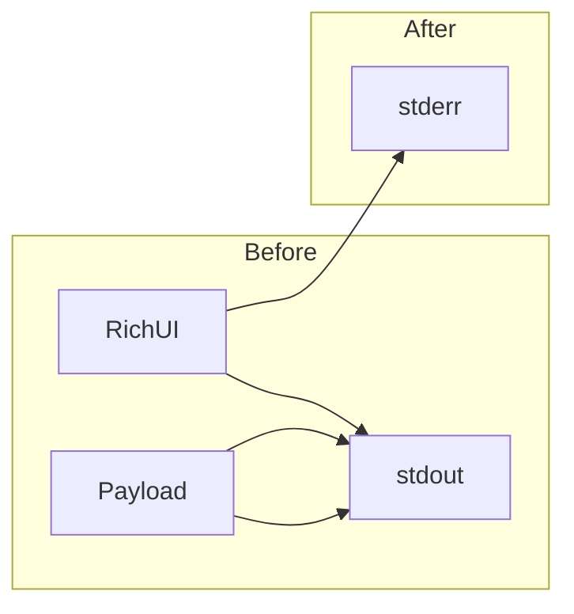

# Hotfix: stdout / stderr separation

## Context

Today, [`main.py`](/opt/AIContextCraft/main.py) instantiates `Console()` without `stderr=True` (line 186), so all `console.print` calls go to **stdout**. The `rich.progress.track` bar in [`craft/context_builder.py`](/opt/AIContextCraft/craft/context_builder.py) (lines 66-69) also writes to stdout by default.

Consequence: in `--output-format json --output-destination stdout` mode, the E2E test [`test_output_json_stdout_without_file_creation`](/opt/AIContextCraft/tests/test_aicc.py) must parse the **last line** of stdout as JSON — any prior Rich output corrupts the stream.

Logging is already correct: [`setup_logging`](/opt/AIContextCraft/craft/utils.py) uses `Console(stderr=True)` (line 29).



## Files to modify

| File | Change |
|---------|------------|
| [`main.py`](/opt/AIContextCraft/main.py) | `Console(stderr=True)`, JSON guards, pass `console` to builder |
| [`craft/context_builder.py`](/opt/AIContextCraft/craft/context_builder.py) | `console` param, `track(..., console=..., disable=...)` |
| [`tests/test_context_builder.py`](/opt/AIContextCraft/tests/test_context_builder.py) | Adapt `_build_context_builder` helper |
| [`tests/test_aicc.py`](/opt/AIContextCraft/tests/test_aicc.py) | Move UI assertions to `stderr` |

## 1. Global console on stderr — `main.py`

Replace line 186:

```python
console = Console(stderr=True)
```

This redirects **all** existing `console.print` calls (config, ignore report, clipboard, dry-run, etc.) to stderr without rewriting them one by one.

## 2. Disable decorative UI in JSON mode — `main.py`

Gate non-structured messages when `args.output_format == "json"`:

- **Line 326** (dry-run banner): `if args.dry_run and args.output_format != "json":`
- **Line 450** (“Concatenating files...”): `if args.output_format != "json" and not args.quiet:`

Blocks already protected by `args.output_format == "human"` (lines 329, 375-380, 498-503, 519-527) stay unchanged.

## 3. Pass console to builder

**`main.py`** — instantiation (lines 451-458):

```python
builder = ContextBuilder(
    project_path=project_path,
    filter_manager=filter_manager,
    ignore_manager=ignore_manager,
    encoding=args.encoding,
    args=args,
    full_body_filters=full_body_filters,
    console=console,
)
```

**`craft/context_builder.py`**:

- Import `Console` from `rich.console`
- Add `console: Console` to `__init__`, store `self.console`
- In `_process_files`, replace `track` call:

```python
file_iterator = track(
    final_file_list,
    description="Processing files...",
    console=self.console,
    disable=not sys.stderr.isatty() or self.args.output_format == "json",
)
```

Note: use `sys.stderr.isatty()` (not `stdout`) because the bar renders on stderr; progress can show when stdout is piped but stderr terminal stays interactive.

## 4. Test updates

### `tests/test_context_builder.py`

In `_build_context_builder`:

- Create `console = Console(stderr=True)`
- Add `output_format="human"` to `argparse.Namespace` (required by `track` disable condition)
- Pass `console=console` to constructor

### `tests/test_aicc.py`

After hotfix, Rich UI is no longer on stdout. Update:

| Test | Adjustment |
|------|------------|
| `test_clipboard_limit_skips_copy_when_output_is_too_large` (line 542) | Use `result.stderr` instead of `result.stdout` for clipboard message |
| `test_console_reports_config_and_ignore_usage` (lines 676-681) | Same: assertions on `result.stderr` |

Tests verifying **absence** of clipboard messages on stdout (lines 543-544, 565-566) remain valid and become stricter.

`test_output_json_stdout_without_file_creation` should pass without changes (main regression case).

## 5. Validation

Run via project venv:

```bash
cd /opt/AIContextCraft
.aicc_venv/bin/python -m pytest tests/test_aicc.py tests/test_context_builder.py
```

Then if needed, full suite: `.aicc_venv/bin/python -m pytest tests`

Report: tests collected, pass/fail, warnings if any.

## 6. Plan publication (requested)

After user validates the plan:

- Copy validated plan to `docs/plans/`
- Rename to `YYYY_MM_DD_HH-MM_feature__docs-c4-ai-context-craft_hotfix-stdout-stderr.plan.md` (ASCII kebab-case title)

## Out of scope (intentional)

- No new E2E test for `--output-destination stdout --format xml` (stderr hotfix + existing tests suffice; can be added later if desired)
- No change to `setup_logging` (already compliant)
- No change to OSC 52 clipboard flow that intentionally writes to stdout (line 35 of `main.py`)

## Risks

- **Test regression**: 2 E2E tests still assert UI on stdout — covered in step 4
- **Third-party `ContextBuilder` usage**: only unit test helper — updated

---

## Implementation report

### Changes made

**`main.py`**
- `Console(stderr=True)` for all Rich UI
- Dry-run banner and “Concatenating files...” hidden in `--output-format json` mode
- `ContextBuilder` receives `console=console` (keyword arguments)

**`craft/context_builder.py`**
- Required `console: Console` parameter
- `track(..., console=self.console, disable=not sys.stderr.isatty() or output_format == "json")`

**Tests**
- `tests/test_context_builder.py`: helper updated with `Console(stderr=True)` and `output_format="human"`
- `tests/test_aicc.py`: UI assertions moved to `stderr` (`test_clipboard_limit_skips_copy_when_output_is_too_large`, `test_console_reports_config_and_ignore_usage`)

### Validation

| Run | Collected | Result |
|-----------|-----------|----------|
| Targeted (`test_aicc` + `test_context_builder`) | 25 | 25 passed |
| Full suite (`tests/`) | 36 | 36 passed |

Warnings: `DeprecationWarning` pathspec `GitWildMatchPattern` (pre-existing, 16 targeted / 112 full suite).

### Modified files

- `main.py`
- `craft/context_builder.py`
- `tests/test_context_builder.py`
- `tests/test_aicc.py`
- `docs/plans/2026_05_17_22-51_feature__docs-c4-ai-context-craft_hotfix-stdout-stderr.plan.md` (timestamped plan copy)
