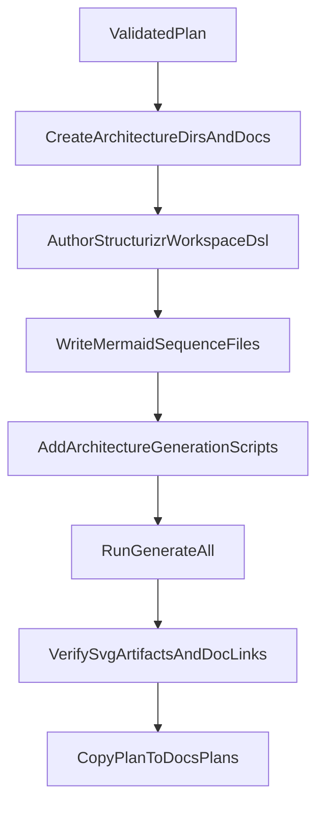

# Implementation plan — C4 documentation for AIContextCraft

## Context
- Dedicated work branch: `feat/docs-c4-ai-context-craft`.
- Plan publication: **yes** (add timestamped copy in `docs/plans/`).
- Existing reference to reuse: wp-manager workflow based on Structurizr + generation scripts + versioned SVG assets.

## Objective
Establish a maintainable, professional architecture documentation base with diagrams-as-code sources, versioned SVG exports, and a simple regeneration process.

## Deliverables
- New architecture folder in AIContextCraft:
  - [`/opt/AIContextCraft/docs/architecture/README.md`](/opt/AIContextCraft/docs/architecture/README.md)
  - [`/opt/AIContextCraft/docs/architecture/structurizr/workspace.dsl`](/opt/AIContextCraft/docs/architecture/structurizr/workspace.dsl)
  - [`/opt/AIContextCraft/docs/architecture/sequences/run-standard-flow.md`](/opt/AIContextCraft/docs/architecture/sequences/run-standard-flow.md)
  - [`/opt/AIContextCraft/docs/architecture/sequences/git-diff-flow.md`](/opt/AIContextCraft/docs/architecture/sequences/git-diff-flow.md)
  - [`/opt/AIContextCraft/docs/architecture/assets/`](/opt/AIContextCraft/docs/architecture/assets/)
- Automation scripts:
  - [`/opt/AIContextCraft/scripts/architecture/render-structurizr.sh`](/opt/AIContextCraft/scripts/architecture/render-structurizr.sh)
  - [`/opt/AIContextCraft/scripts/architecture/validate-mermaid.sh`](/opt/AIContextCraft/scripts/architecture/validate-mermaid.sh)
  - [`/opt/AIContextCraft/scripts/architecture/render-diagram-assets.sh`](/opt/AIContextCraft/scripts/architecture/render-diagram-assets.sh)
  - [`/opt/AIContextCraft/scripts/architecture/generate-all.sh`](/opt/AIContextCraft/scripts/architecture/generate-all.sh)
- Documentation entry update:
  - [`/opt/AIContextCraft/README.md`](/opt/AIContextCraft/README.md) (“Architecture” section + generation command)

## Implementation steps
1. **Initialize docs/scripts structure**
   - Create `docs/architecture/{structurizr,sequences,assets}` and `scripts/architecture`.
   - Add architecture `README` documenting prerequisites, single command, and update rules.

2. **Create C4 source model (Structurizr DSL)**
   - Define actors (developer/operator), external systems (project filesystem, clipboard, git), and internal containers (CLI entrypoint, selection/filter engine, formatter, output).
   - Produce at least 2 C4 views:
     - `systemContext`
     - `containerView`
   - Optional but recommended: focused `processingFlowView` if the main graph becomes heavy.

3. **Add dynamic diagrams (Mermaid)**
   - `run-standard-flow.md`: scan -> filters -> tree build -> render -> output destination.
   - `git-diff-flow.md`: dedicated `--git-diff REF_A REF_B` path.

4. **Industrialize generation**
   - Adapt wp-manager script pattern in AIContextCraft.
   - `generate-all.sh` orchestrates: Structurizr export -> Mermaid validation -> SVG generation.
   - Global script fails explicitly if any step fails.

5. **Version SVGs and wire documentation**
   - Generate SVGs in `docs/architecture/assets/`.
   - Reference assets in `docs/architecture/README.md` and add link in root `README.md`.

6. **Final validation**
   - Run the single generation command.
   - Verify expected views (C4 + sequences) and filename consistency.
   - Verify reproducibility (second run without unexpected drift).

7. **Plan publication (requested)**
   - Copy validated plan to `docs/plans/`.
   - Rename to `YYYY_MM_DD_HH:MM_<branch-slug>_<plan-title>.plan.md` (ASCII kebab-case title).

## Implementation flow (quick view)

## Acceptance criteria
- Repo contains a single C4 source (`workspace.dsl`) and readable Mermaid sequences.
- One command regenerates all artifacts without manual export editing.
- Versioned SVGs are present and referenced in documentation.
- Architecture onboarding possible in <10 minutes via root `README` + `docs/architecture/README.md`.

---
## Implementation report

### Changes made
- Architecture documentation created under `docs/architecture`:
  - `README.md`
  - `structurizr/workspace.dsl`
  - `sequences/run-standard-flow.md`
  - `sequences/git-diff-flow.md`
- Generation pipeline added under `scripts/architecture`:
  - `render-structurizr.sh`
  - `validate-mermaid.sh`
  - `render-diagram-assets.sh`
  - `generate-all.sh`
- Root `README.md` updated with architecture section and single generation command.
- Plan published at `docs/plans/2026_05_17_22:18_feature__docs-c4-ai-context-craft_documentation-c4-aicontextcraft.plan.md`.

### Validation / tests
- `./scripts/architecture/generate-all.sh` executed.
- Result:
  - Structurizr export: failed (Docker daemon not running),
  - Mermaid validation: skipped (`mmdc` unavailable),
  - SVG generation: failed (`.puml` files missing due to export failure).
- Lints: no diagnostics on modified files.
- Applicable Python unit tests: not required (no business logic changes).
