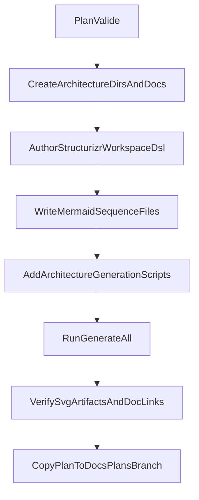

# Plan d'implémentation — Documentation C4 pour AIContextCraft

## Contexte retenu
- Branche de travail dédiée: `feat/docs-c4-ai-context-craft`.
- Publication du plan: **oui** (ajouter la copie horodatée dans `docs/plans/<branch-name>/`).
- Référence existante à réutiliser: workflow `wp-manager` basé sur Structurizr + scripts de génération + assets SVG.

## Objectif
Établir une base de documentation d’architecture maintenable et “pro”, avec des sources diagrams-as-code, des exports SVG versionnés et un process simple de régénération.

## Livrables
- Nouveau dossier architecture dans AIContextCraft:
  - [`/opt/AIContextCraft/docs/architecture/README.md`](/opt/AIContextCraft/docs/architecture/README.md)
  - [`/opt/AIContextCraft/docs/architecture/structurizr/workspace.dsl`](/opt/AIContextCraft/docs/architecture/structurizr/workspace.dsl)
  - [`/opt/AIContextCraft/docs/architecture/sequences/run-standard-flow.md`](/opt/AIContextCraft/docs/architecture/sequences/run-standard-flow.md)
  - [`/opt/AIContextCraft/docs/architecture/sequences/git-diff-flow.md`](/opt/AIContextCraft/docs/architecture/sequences/git-diff-flow.md)
  - [`/opt/AIContextCraft/docs/architecture/assets/`](/opt/AIContextCraft/docs/architecture/assets/)
- Scripts d’automatisation:
  - [`/opt/AIContextCraft/scripts/architecture/render-structurizr.sh`](/opt/AIContextCraft/scripts/architecture/render-structurizr.sh)
  - [`/opt/AIContextCraft/scripts/architecture/validate-mermaid.sh`](/opt/AIContextCraft/scripts/architecture/validate-mermaid.sh)
  - [`/opt/AIContextCraft/scripts/architecture/render-diagram-assets.sh`](/opt/AIContextCraft/scripts/architecture/render-diagram-assets.sh)
  - [`/opt/AIContextCraft/scripts/architecture/generate-all.sh`](/opt/AIContextCraft/scripts/architecture/generate-all.sh)
- Mise à jour d’entrée de doc:
  - [`/opt/AIContextCraft/README.md`](/opt/AIContextCraft/README.md) (section “Architecture” + commande de génération)

## Étapes d’implémentation
1. **Initialiser la structure docs/scripts**
   - Créer l’arborescence `docs/architecture/{structurizr,sequences,assets}` et `scripts/architecture`.
   - Ajouter un `README` d’architecture qui documente prérequis, commande unique et règles de mise à jour.

2. **Créer le modèle C4 source (Structurizr DSL)**
   - Définir les acteurs (développeur/opérateur), systèmes externes (filesystem projet, clipboard, git), et conteneurs internes (CLI entrypoint, moteur de sélection/filtrage, formatter, sortie).
   - Produire au minimum 2 vues C4:
     - `systemContext`
     - `containerView`
   - Optionnel mais recommandé: vue focalisée `processingFlowView` si le graphe principal devient chargé.

3. **Ajouter les diagrammes dynamiques (Mermaid)**
   - `run-standard-flow.md`: enchaînement scan -> filtres -> construction arbre -> rendu -> destination sortie.
   - `git-diff-flow.md`: chemin dédié `--git-diff REF_A REF_B`.

4. **Industrialiser la génération**
   - Adapter dans AIContextCraft le pattern de scripts présent dans wp-manager.
   - `generate-all.sh` orchestre: export Structurizr -> validation Mermaid -> génération SVG.
   - Échec explicite du script global si une étape échoue.

5. **Versionner les SVG et brancher la doc**
   - Générer les SVG dans `docs/architecture/assets/`.
   - Référencer ces assets dans `docs/architecture/README.md` et ajouter un lien dans `README.md` racine.

6. **Validation finale**
   - Exécuter la commande unique de génération.
   - Vérifier présence des vues attendues (C4 + séquences) et cohérence des noms de fichiers.
   - Vérifier la reproductibilité (2e exécution sans drift inattendu).

7. **Publication du plan (demandée)**
   - Copier le plan validé dans `docs/plans/<branch-name>/`.
   - Renommer avec le format `YYYY_MM_DD_HH:MM_<plan-title>.plan.md` (titre normalisé kebab-case ASCII).

## Flux d’implémentation (vue rapide)

## Critères d’acceptation
- Le repo contient une source C4 unique (`workspace.dsl`) et des séquences Mermaid lisibles.
- Une commande unique régénère tous les artefacts sans édition manuelle des exports.
- Les SVG versionnés sont présents et référencés dans la documentation.
- L’onboarding architecture est possible en <10 minutes via `README` racine + `docs/architecture/README.md`.

---
## Compte rendu d'implementation

### Changements effectués
- Création de la documentation architecture sous `docs/architecture`:
  - `README.md`
  - `structurizr/workspace.dsl`
  - `sequences/run-standard-flow.md`
  - `sequences/git-diff-flow.md`
- Ajout de la chaîne de génération sous `scripts/architecture`:
  - `render-structurizr.sh`
  - `validate-mermaid.sh`
  - `render-diagram-assets.sh`
  - `generate-all.sh`
- Mise à jour de `README.md` (racine) avec section architecture et commande unique de génération.
- Publication du plan dans `docs/plans/refactor/wpaas-vanilla-config/2026_05_17_22:18_documentation-c4-aicontextcraft.plan.md`.

### Validation / tests
- Exécution de `./scripts/architecture/generate-all.sh` lancée.
- Résultat:
  - export Structurizr: échec (daemon Docker non démarré),
  - validation Mermaid: ignorée (`mmdc` indisponible),
  - génération SVG: échec (fichiers `.puml` absents suite à l’échec export).
- Lints: aucun diagnostic remonté sur les fichiers modifiés.
- Tests unitaires Python applicatifs: non requis (pas de changement de logique métier).
