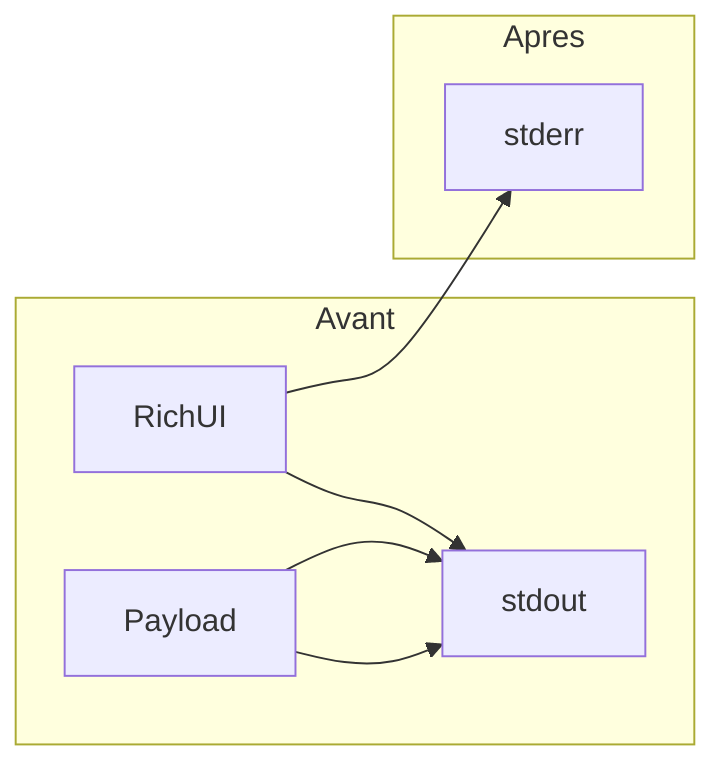

# Hotfix : séparation stdout / stderr

## Contexte

Aujourd'hui, [`main.py`](/opt/AIContextCraft/main.py) instancie `Console()` sans `stderr=True` (l.186), donc tous les `console.print` partent sur **stdout**. La barre `rich.progress.track` dans [`craft/context_builder.py`](/opt/AIContextCraft/craft/context_builder.py) (l.66-69) écrit aussi sur stdout par défaut.

Conséquence : en mode `--output-format json --output-destination stdout`, le test E2E [`test_output_json_stdout_without_file_creation`](/opt/AIContextCraft/tests/test_aicc.py) doit parser la **dernière ligne** de stdout comme JSON — toute sortie Rich avant corrompt le flux.

Les logs sont déjà corrects : [`setup_logging`](/opt/AIContextCraft/craft/utils.py) utilise `Console(stderr=True)` (l.29).



## Fichiers à modifier

| Fichier | Changement |
|---------|------------|
| [`main.py`](/opt/AIContextCraft/main.py) | `Console(stderr=True)`, garde-fous JSON, passage de `console` au builder |
| [`craft/context_builder.py`](/opt/AIContextCraft/craft/context_builder.py) | Param `console`, `track(..., console=..., disable=...)` |
| [`tests/test_context_builder.py`](/opt/AIContextCraft/tests/test_context_builder.py) | Adapter le helper `_build_context_builder` |
| [`tests/test_aicc.py`](/opt/AIContextCraft/tests/test_aicc.py) | Assertions UI déplacées vers `stderr` |

## 1. Console globale sur stderr — `main.py`

Remplacer l.186 :

```python
console = Console(stderr=True)
```

Cela redirige **tous** les `console.print` existants (config, ignore report, clipboard, dry-run, etc.) vers stderr sans les réécrire un par un.

## 2. Couper l'UI décorative en mode JSON — `main.py`

Conditionner les messages non structurés quand `args.output_format == "json"` :

- **L.326** (bannière dry-run) : `if args.dry_run and args.output_format != "json":`
- **L.450** (« Concaténation des fichiers... ») : `if args.output_format != "json" and not args.quiet:`

Les blocs déjà protégés par `args.output_format == "human"` (l.329, 375-380, 498-503, 519-527) restent inchangés.

## 3. Propager la console au builder

**`main.py`** — instanciation (l.451-458) :

```python
builder = ContextBuilder(
    project_path=project_path,
    filter_manager=filter_manager,
    ignore_manager=ignore_manager,
    encoding=args.encoding,
    args=args,
    full_body_filters=full_body_filters,
    console=console,
)
```

**`craft/context_builder.py`** :

- Importer `Console` depuis `rich.console`
- Ajouter `console: Console` au `__init__`, stocker `self.console`
- Dans `_process_files`, remplacer l'appel `track` :

```python
file_iterator = track(
    final_file_list,
    description="Traitement des fichiers...",
    console=self.console,
    disable=not sys.stderr.isatty() or self.args.output_format == "json",
)
```

Note : utiliser `sys.stderr.isatty()` (et non `stdout`) car la barre sera rendue sur stderr ; cela permet d'afficher la progression quand stdout est pipé mais le terminal stderr reste interactif.

## 4. Mise à jour des tests

### `tests/test_context_builder.py`

Dans `_build_context_builder` :

- Créer `console = Console(stderr=True)`
- Ajouter `output_format="human"` au `argparse.Namespace` (requis par la condition `disable` du `track`)
- Passer `console=console` au constructeur

### `tests/test_aicc.py`

Après le hotfix, l'UI Rich n'est plus sur stdout. Mettre à jour :

| Test | Ajustement |
|------|------------|
| `test_clipboard_limit_skips_copy_when_output_is_too_large` (l.542) | `result.stderr` au lieu de `result.stdout` pour le message presse-papiers |
| `test_console_reports_config_and_ignore_usage` (l.676-681) | Idem : assertions sur `result.stderr` |

Les tests qui vérifient l'**absence** de messages clipboard dans stdout (l.543-544, 565-566) restent valides et deviennent plus stricts.

`test_output_json_stdout_without_file_creation` devrait passer sans modification (c'est le cas de régression principal).

## 5. Validation

Exécuter via le venv du projet :

```bash
cd /opt/AIContextCraft
.aicc_venv/bin/python -m pytest tests/test_aicc.py tests/test_context_builder.py
```

Puis, si besoin, la suite complète : `.aicc_venv/bin/python -m pytest tests`

Rapporter : nombre de tests collectés, pass/fail, warnings éventuels.

## 6. Publication du plan (demandée)

Après validation utilisateur du plan :

- Créer [`docs/plans/feature/docs-c4-ai-context-craft/`](/opt/AIContextCraft/docs/plans/feature/docs-c4-ai-context-craft/) si absent
- Copier le plan validé avec le nom horodaté : `YYYY_MM_DD_HH:MM_hotfix-stdout-stderr.plan.md` (kebab-case ASCII pour le titre)

## Hors scope (volontairement)

- Pas de nouveau test E2E `--output-destination stdout --format xml` (le hotfix stderr + tests existants suffisent ; peut être ajouté plus tard si souhaité)
- Pas de modification de `setup_logging` (déjà conforme)
- Pas de changement du flux OSC 52 clipboard qui écrit volontairement sur stdout (l.35 de `main.py`)

## Risques

- **Régression tests** : 2 tests E2E assertent encore l'UI sur stdout — couverts à l'étape 4
- **Instanciations tierces** de `ContextBuilder` : seul le helper de test unitaire — mis à jour

---

## Compte rendu d'implementation

### Changements réalisés

**`main.py`**
- `Console(stderr=True)` pour toute l'UI Rich
- Bannière dry-run et message « Concaténation des fichiers... » masqués en mode `--output-format json`
- `ContextBuilder` reçoit `console=console` (arguments nommés)

**`craft/context_builder.py`**
- Paramètre `console: Console` obligatoire
- `track(..., console=self.console, disable=not sys.stderr.isatty() or output_format == "json")`

**Tests**
- `tests/test_context_builder.py` : helper mis à jour avec `Console(stderr=True)` et `output_format="human"`
- `tests/test_aicc.py` : assertions UI déplacées vers `stderr` (`test_clipboard_limit_skips_copy_when_output_is_too_large`, `test_console_reports_config_and_ignore_usage`)

### Validation

| Exécution | Collectés | Résultat |
|-----------|-----------|----------|
| Ciblés (`test_aicc` + `test_context_builder`) | 25 | 25 passed |
| Suite complète (`tests/`) | 36 | 36 passed |

Warnings : `DeprecationWarning` pathspec `GitWildMatchPattern` (préexistants, 16 ciblés / 112 suite complète).

### Fichiers modifiés

- `main.py`
- `craft/context_builder.py`
- `tests/test_context_builder.py`
- `tests/test_aicc.py`
- `docs/plans/feature/docs-c4-ai-context-craft/2026_05_17_22:51_hotfix-stdout-stderr.plan.md` (copie horodatée du plan)
