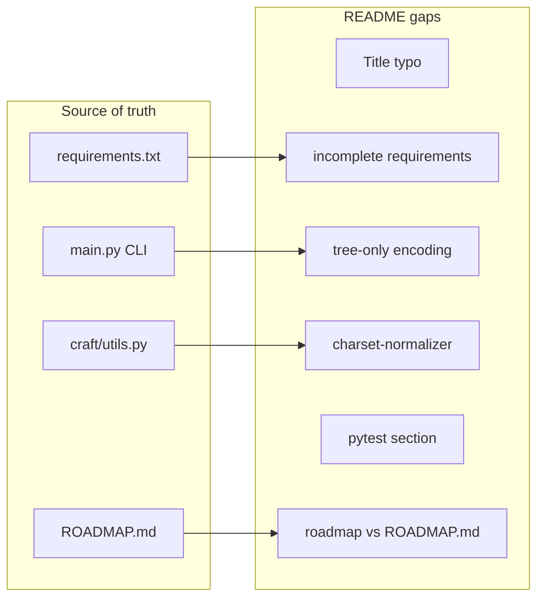

# AIContextCraft README update

## Verdict

**Yes, an update is recommended** — not a full rewrite. The README already reflects most current behavior (Zero-Config, `xml|markdown|text` formats, hierarchical ignore, `--git-diff`, `build/aicc_context.<ext>` output, C4 docs). Gaps are mostly **omissions**, a **typo**, and sections **partially outdated** vs recent deliveries (phase 1.8, 36 tests, `charset-normalizer`).

## Gaps found (prioritized)

### Blocking / visible

| Issue | Current README | Code reality |
|----------|---------------|-----------------|
| File H1 title | `# AI Context Craft Craft Craft` (line 1) | Obvious typo; should be `# AI Context Craft` |
| Installation | `pip install pyyaml tiktoken` only | [`requirements.txt`](/opt/AIContextCraft/requirements.txt) lists 7 deps: `pyyaml`, `tiktoken`, `pathspec`, `pytest`, `rich`, `pyperclip`, `charset-normalizer` |
| CLI options table | 15 documented flags | [`main.py`](/opt/AIContextCraft/main.py) also exposes `--tree-only` and `--encoding` (in `--help` snapshot but missing from table lines 84–103) |

### Undocumented features

- **`--tree-only`**: tree-only mode (sizes/extensions); already in README `--help` snapshot but not in “Key Features” or CLI table.
- **Robust encoding (phase 1.8 step 3)**: [`craft/utils.py`](/opt/AIContextCraft/craft/utils.py) `read_file_with_fallback()` uses `charset-normalizer` after UTF-8 failure; README mentions neither dependency nor behavior (detection + controlled `replace` fallback with warning).
- **Tests**: 36 tests collected (`pytest tests`); no “Development / Testing” section despite modular `craft/` layout and test coverage.

### Minor inconsistencies

- **Configuration section**: title `Configuration (config.yaml)` while auto-detection does not look for `config.yaml` (candidates: `.aicc.yaml`, `aicc.yaml`, `aicc.yml`, `config-concat-code.yaml` — consistent elsewhere in README).
- **Inline roadmap** (lines 256–263): Phase 3 described as “Git diff available” while [`ROADMAP.md`](/opt/AIContextCraft/ROADMAP.md) places git-diff in **current state / Phase 1** and reserves **Phase 3** for Focus filtering (`--focus-git`, `--focus`). Risk of contributor confusion.
- **venv**: examples use generic `venv`; repo convention (Cursor rules + recent plans) is `.aicc_venv`.
- **Clone URL**: placeholder `github.com/your-username/ai-context-craft` — leave as-is or replace if real URL exists (out of technical scope).

### Already correct (do not over-document)

- Quick Start: `python main.py`, `aicc.py` alias, default output `build/aicc_context.<ext>`.
- Two-stage filtering (Shield + Scalpel), LLM formats, clipboard, `--output-format` / `--output-destination`.
- **Architecture Documentation** section aligned with [`docs/architecture/README.md`](/opt/AIContextCraft/docs/architecture/README.md) and `./scripts/architecture/generate-all.sh`.



## Proposed edit plan

Single file: [`/opt/AIContextCraft/README.md`](/opt/AIContextCraft/README.md).

### 1. Immediate fixes

- Fix H1 (remove duplicate “Craft Craft”).
- Replace manual install with:

```bash
python -m venv .aicc_venv
source .aicc_venv/bin/activate
pip install -r requirements.txt
```

- Keep a Windows note for `Scripts\activate`.

### 2. Enrich “Key Features”

Add short bullets for:

- `--tree-only` (structure preview without file content).
- Robust file encoding reads (strict UTF-8, `charset-normalizer` detection, controlled fallback) — one sentence, implicit link to `--encoding`.

### 3. Complete CLI table

Add two rows to the table (lines 84–103):

| Flag | Description |
|------|-------------|
| `--tree-only` | Generate project tree only (sizes, extensions), without file contents. |
| `--encoding ENCODING` | Target encoding for file reads (default: `utf-8`). |

Verify embedded `--help` snapshot (lines 105–149) stays in sync after edit (already OK for these flags).

### 4. New short “Development” section

Insert before “Contributing”:

```bash
.aicc_venv/bin/python -m pytest tests
# targeted: .aicc_venv/bin/python -m pytest tests/test_context_builder.py
```

Mention ~36 tests (update if count changes on run).

### 5. Align README roadmap

Replace inline roadmap block (lines 256–263) with a concise pointer:

- Phases 0–1: complete (see [`ROADMAP.md`](/opt/AIContextCraft/ROADMAP.md)).
- Phase 2: tree-sitter / multi-language.
- Phase 3: Focus (not git-diff, already delivered).

Avoid duplicating all of `ROADMAP.md` — bullet list + link is enough.

### 6. Configuration

- Rename section title to `Configuration (YAML)` or explicitly list auto-detected file names.
- Optional: note that `output_path` in a config file overrides `build/aicc_context.<ext>` fallback.

### 7. Post-edit validation

- Visual README review (relative links, English consistency).
- Run `python main.py --help` and compare to embedded snapshot (update block if divergent).
- No code changes required for this task.

## Plan publication (requested)

After plan validation:

1. Copy this validated plan into `docs/plans/` (current branch slug in filename).
2. Rename to `YYYY_MM_DD_HH-MM_main_readme-audit-update.plan.md` (ASCII kebab-case title).

## Out of scope (unless explicitly requested)

- FR/EN README translation (this plan task is documentation update; plans are now in English).
- Replace GitHub placeholder URL.
- Update `ROADMAP.md` (already up to date).
- Modify `config-concat-code.yaml` (local example file, not user docs).

## Estimate

~30–45 minutes writing + review; low regression risk (documentation only).
