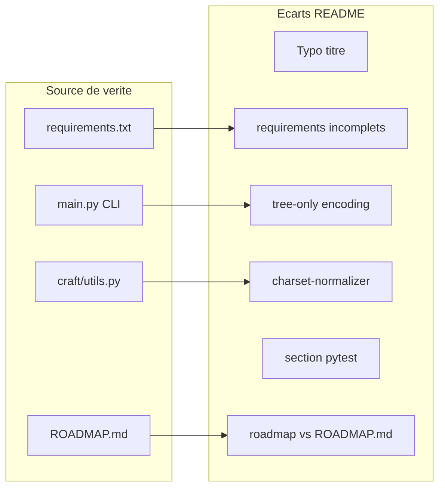

# Mise à jour du README AIContextCraft

## Verdict

**Oui, une mise à jour est recommandée** — pas une réécriture complète. Le README reflète déjà correctement la majorité du comportement actuel (Zero-Config, formats `xml|markdown|text`, ignore hiérarchique, `--git-diff`, sortie `build/aicc_context.<ext>`, doc C4). Les écarts sont surtout des **oublis**, une **typo**, et des sections **partiellement obsolètes** par rapport aux livraisons récentes (phase 1.8, 36 tests, `charset-normalizer`).

## Écarts constatés (priorisés)

### Bloquants / visibles

| Problème | README actuel | Réalité du code |
|----------|---------------|-----------------|
| Titre H1 du fichier | `# AI Context Craft Craft Craft` (l.1) | Typo évidente à corriger en `# AI Context Craft` |
| Installation | `pip install pyyaml tiktoken` uniquement | [`requirements.txt`](/opt/AIContextCraft/requirements.txt) liste 7 deps : `pyyaml`, `tiktoken`, `pathspec`, `pytest`, `rich`, `pyperclip`, `charset-normalizer` |
| Tableau des options CLI | 15 flags documentés | [`main.py`](/opt/AIContextCraft/main.py) expose aussi `--tree-only` et `--encoding` (présents dans le snapshot `--help` mais absents du tableau l.84–103) |

### Fonctionnalités non documentées

- **`--tree-only`** : mode arbre seul (tailles/extensions), déjà dans le snapshot d’aide du README mais pas dans « Key Features » ni le tableau CLI.
- **Encodage robuste (phase 1.8 step 3)** : [`craft/utils.py`](/opt/AIContextCraft/craft/utils.py) `read_file_with_fallback()` utilise `charset-normalizer` après échec UTF-8 ; le README ne mentionne ni la dépendance ni le comportement (détection + fallback `replace` avec warning).
- **Tests** : 36 tests collectés (`pytest tests`) ; aucune section « Development / Testing » alors que le projet est modulaire (`craft/`) et testé.

### Incohérences mineures

- **Section Configuration** : titre `Configuration (config.yaml)` alors que l’auto-détection ne cherche pas `config.yaml` (candidats : `.aicc.yaml`, `aicc.yaml`, `aicc.yml`, `config-concat-code.yaml` — cohérent ailleurs dans le README).
- **Roadmap intégrée** (l.256–263) : Phase 3 décrite comme « Git diff disponible » alors que [`ROADMAP.md`](/opt/AIContextCraft/ROADMAP.md) place le git-diff en **état actuel / Phase 1** et réserve la **Phase 3** au filtrage Focus (`--focus-git`, `--focus`). Risque de confusion pour les contributeurs.
- **venv** : exemples utilisent `venv` générique ; la convention du repo (règles Cursor + plans récents) est `.aicc_venv`.
- **URL clone** : placeholder `github.com/your-username/ai-context-craft` — à laisser tel quel ou remplacer si une URL réelle existe (hors scope technique).

### Déjà correct (ne pas sur-documenter)

- Quick Start : `python main.py`, alias `aicc.py`, sortie par défaut `build/aicc_context.<ext>`.
- Two-stage filtering (Shield + Scalpel), formats LLM, clipboard, `--output-format` / `--output-destination`.
- Section **Architecture Documentation** alignée avec [`docs/architecture/README.md`](/opt/AIContextCraft/docs/architecture/README.md) et `./scripts/architecture/generate-all.sh`.



## Plan d’édition proposé

Fichier unique : [`/opt/AIContextCraft/README.md`](/opt/AIContextCraft/README.md).

### 1. Corrections immédiates

- Corriger le H1 (supprimer le doublon « Craft Craft »).
- Remplacer l’installation manuelle par :

```bash
python -m venv .aicc_venv
source .aicc_venv/bin/activate
pip install -r requirements.txt
```

- Conserver une note Windows pour `Scripts\activate`.

### 2. Enrichir « Key Features »

Ajouter une puce courte pour :

- `--tree-only` (aperçu structure sans contenu).
- Lecture robuste des encodages (UTF-8 strict, détection `charset-normalizer`, fallback contrôlé) — une phrase, lien implicite avec `--encoding`.

### 3. Compléter le tableau CLI

Ajouter deux lignes au tableau (l.84–103) :

| Flag | Description |
|------|-------------|
| `--tree-only` | Génère uniquement l’arbre du projet (tailles, extensions), sans contenu des fichiers. |
| `--encoding ENCODING` | Encodage cible pour la lecture des fichiers (défaut : `utf-8`). |

Vérifier que le snapshot `--help` (l.105–149) reste synchronisé après édition (déjà OK pour ces flags).

### 4. Nouvelle section « Development » (courte)

Insérer avant « Contributing » :

```bash
.aicc_venv/bin/python -m pytest tests
# ciblé : .aicc_venv/bin/python -m pytest tests/test_context_builder.py
```

Mentionner ~36 tests (mettre à jour si le nombre change lors de l’exécution).

### 5. Aligner la roadmap du README

Remplacer le bloc roadmap inline (l.256–263) par un renvoi concis :

- Phase 0–1 : terminées (référence [`ROADMAP.md`](/opt/AIContextCraft/ROADMAP.md)).
- Phase 2 : tree-sitter / multi-langage.
- Phase 3 : Focus (pas git-diff, déjà livré).

Éviter de dupliquer tout le contenu de `ROADMAP.md` — une liste à puces + lien suffit.

### 6. Configuration

- Renommer le titre de section en `Configuration (YAML)` ou lister explicitement les noms de fichiers auto-détectés.
- Optionnel : préciser que `output_path` dans un fichier de config surcharge le fallback `build/aicc_context.<ext>`.

### 7. Validation post-édition

- Relecture visuelle du README (liens relatifs, cohérence anglais).
- Exécuter `python main.py --help` et comparer au snapshot embarqué (mise à jour du bloc si divergence).
- Pas de changement de code requis pour cette tâche.

## Publication du plan (demandée)

Après validation du plan :

1. Créer `docs/plans/<branch-name>/` si absent (branche courante au moment de l’exécution).
2. Copier ce plan validé dans ce dossier.
3. Renommer en `YYYY_MM_DD_HH:MM_readme-audit-update.plan.md` (kebab-case ASCII pour le titre).

## Hors scope (sauf demande explicite)

- Traduction FR/EN du README.
- Remplacement de l’URL GitHub placeholder.
- Mise à jour de `ROADMAP.md` (déjà à jour).
- Modification de `config-concat-code.yaml` (fichier local d’exemple du dépôt, pas doc utilisateur).

## Estimation

~30–45 minutes de rédaction + relecture ; faible risque de régression (documentation seule).
