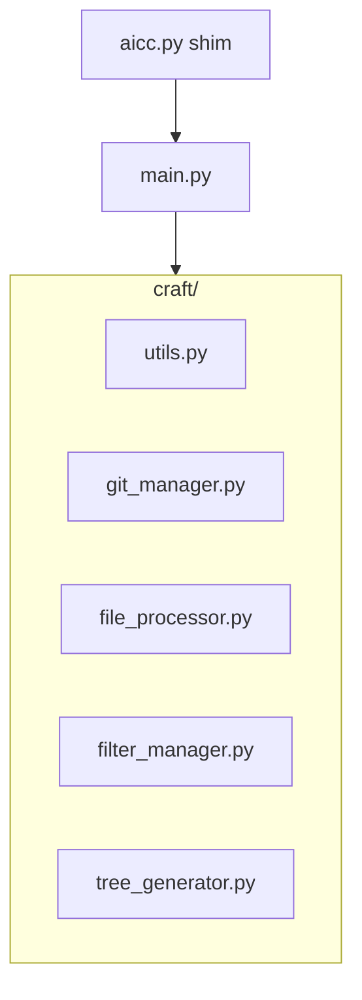

# Phase 0 — Refactoring modulaire (fondation)

## Objectif

Passer d'un script monolithique ([`aicc.py`](/opt/AIContextCraft/aicc.py), ~509 lignes) à une architecture modulaire dans le package [`craft/`](/opt/AIContextCraft/craft/), **sans modifier le comportement fonctionnel** (refactoring iso-fonctionnel).

Contraintes de cette phase :

- Préserver toutes les options CLI existantes, dont `--git-diff` (rapport Markdown du diff Git entre deux révisions).
- Préserver les optimisations `os.walk` avec élagage des dossiers exclus (arborescence et parcours des fichiers).
- Maintenir **deux points d'entrée** équivalents : `main.py` (canonique) et `aicc.py` (compatibilité).
- Nettoyer les imports inutilisés (`io`, `tokenize` aujourd'hui morts dans `aicc.py`).
- Faire passer les **6 tests** de [`tests/test_aicc.py`](/opt/AIContextCraft/tests/test_aicc.py).

Branche cible : `refactor/phase-0`.

---

## Emplacement du plan

Ce plan vit dans le dépôt à :

[`docs/plans/refactor/phase-0/2026_05_17_16:00_phase-0-refactoring.plan.md`](/opt/AIContextCraft/docs/plans/refactor/phase-0/2026_05_17_16:00_phase-0-refactoring.plan.md)

(horodatage ajusté au moment de la première sauvegarde si nécessaire)

---

## Architecture cible

```text
/opt/AIContextCraft/
├── main.py                 # Point d'entrée canonique (orchestrateur)
├── aicc.py                 # Point d'entrée de compatibilité (délègue à main)
├── config.yaml
├── craft/
│   ├── __init__.py
│   ├── utils.py            # logging, stats, format_bytes
│   ├── git_manager.py      # get_git_diff
│   ├── file_processor.py   # strip_comments, get_python_headers
│   ├── filter_manager.py   # normalize_glob_patterns
│   └── tree_generator.py   # generate_tree
├── README.md               # documente main.py et aicc.py
└── tests/
    ├── test_aicc.py        # subprocess via main.py
    └── setup_tests.sh      # idem
```



---

## Répartition des responsabilités

### [`craft/utils.py`](/opt/AIContextCraft/craft/utils.py)

- `TIKTOKEN_AVAILABLE` + import optionnel `tiktoken`
- `setup_logging(log_file_path, verbose)`
- `format_bytes(size)`
- `get_file_stats(content_str, encoding='utf-8')`

### [`craft/git_manager.py`](/opt/AIContextCraft/craft/git_manager.py)

- `get_git_diff(repo_path, ref_a, ref_b)` — vérifie le dépôt Git, exécute `git diff`, remonte les erreurs (`RuntimeError`) avec messages inchangés.

### [`craft/file_processor.py`](/opt/AIContextCraft/craft/file_processor.py)

- `strip_comments_from_code(content, file_path)` — AST Python, shell/Dockerfile.
- `get_python_headers(content, full_body_filters_patterns)` — signatures + docstrings partielles.

Imports : `ast`, `pathlib.Path`, `fnmatch`, `logging` uniquement.

### [`craft/filter_manager.py`](/opt/AIContextCraft/craft/filter_manager.py)

- `normalize_glob_patterns(patterns)` — normalisation `\` → `/` pour matching cross-platform.

### [`craft/tree_generator.py`](/opt/AIContextCraft/craft/tree_generator.py)

- `generate_tree(directory, include_spec, exclude_spec, show_sizes=False)` — arborescence avec élagage `os.walk`.

### [`main.py`](/opt/AIContextCraft/main.py)

Orchestrateur unique. Contient `main()` et :

- parsing `argparse` (toutes les options actuelles) ;
- chargement / fusion YAML + messages d'erreur YAML (aide backslash) ;
- branche `--git-diff` (conversion `.txt` → `.md`, stats, dry-run) ;
- assemblage filtres (`clean_patterns`, `pathspec`, `.gitignore`) ;
- boucle `os.walk` pour lister les fichiers ;
- lecture, transformation (`strip-comments`, `headers-only`), écriture sortie.

**Ne pas déplacer** dans cette phase : logique de configuration complète, assemblage avancé des filtres (voir section « Reporté »).

### [`aicc.py`](/opt/AIContextCraft/aicc.py) — compatibilité

Fichier minimal (~5 lignes), sans logique métier :

```python
"""Point d'entrée de compatibilité. Délègue à main.main()."""
from main import main

if __name__ == "__main__":
    main()
```

Les scripts, habitudes et documentation existants qui invoquent `python aicc.py` continuent de fonctionner.

---

## Étapes d'implémentation

### 1. Publier le plan

Créer [`docs/plans/refactor/phase-0/`](/opt/AIContextCraft/docs/plans/refactor/phase-0/) et y copier ce fichier.

### 2. Créer `craft/`

- `craft/__init__.py` (package vide ou exports explicites).

### 3. Extraire les modules (ordre feuilles → racine)

`utils` → `git_manager` → `file_processor` → `filter_manager` → `tree_generator`.

Chaque module n'importe que ce qu'il utilise réellement.

### 4. Créer `main.py`

- Migrer `main()` depuis `aicc.py` en remplaçant les fonctions extraites par `from craft... import ...`.
- Conserver ligne à ligne : messages, flux, codes de sortie, format des fichiers générés.

### 5. Créer le shim `aicc.py`

- Remplacer le monolithe actuel par le délégué vers `main.main()` (voir snippet ci-dessus).

### 6. Nettoyer les imports inutiles

- Supprimer `io` et `tokenize` (jamais utilisés dans le monolithe actuel).
- Vérifier chaque fichier `craft/*.py` et `main.py` : aucun import orphelin après extraction.
- Ne pas introduire de nouvelles dépendances.

### 7. Mettre à jour README

Dans [`README.md`](/opt/AIContextCraft/README.md) :

- Présenter **`python main.py`** comme commande principale.
- Indiquer que **`python aicc.py`** reste supporté (alias de compatibilité, même comportement).
- Mettre à jour tous les exemples (sections Usage, Example Workflow, tableau CLI si des exemples y figurent).

### 8. Mettre à jour les tests et scripts de test

| Fichier | Changement |
|---|---|
| [`tests/test_aicc.py`](/opt/AIContextCraft/tests/test_aicc.py) | `AICC_SCRIPT = PROJECT_ROOT / 'main.py'` (entrée canonique pour pytest) |
| [`tests/setup_tests.sh`](/opt/AIContextCraft/tests/setup_tests.sh) | `AICC_SCRIPT="$PROJECT_ROOT/main.py"` |

**Ne pas modifier** : `tests/test_projects/**` (golden files).

**Vérification manuelle complémentaire** (hors pytest) : lancer une commande identique via `python aicc.py` et `python main.py` sur `basic_project` ; sorties identiques.

### 9. Non-régression

```bash
cd /opt/AIContextCraft
.aicc_venv/bin/python -m pytest tests/test_aicc.py -v
```

Critère : **6/6** tests passent.

### 10. Post-implémentation

1. Compte rendu dans le chat (fichiers modifiés, résultats tests).
2. Demander si le compte rendu est appendé au plan (`---` + `## Compte rendu d'implementation`).
3. Proposer un message de commit Conventional Commits.

---

## Règles strictes

- **Zéro nouvelle fonctionnalité** : pas de tqdm, presse-papiers, profils YAML, etc.
- **Zéro changement de sortie** : mêmes fichiers générés, en-têtes, diffs, logs, codes retour.
- **Imports minimaux** par module après nettoyage.
- **Deux entrées, un comportement** : `aicc.py` et `main.py` doivent produire des résultats identiques.

---

## Validation

| Contrôle | Méthode |
|---|---|
| Tests automatisés | `pytest tests/test_aicc.py` → 6 tests OK |
| Compatibilité `aicc.py` | smoke test manuel ou script one-liner identique sur les deux entrées |
| README | exemples cohérents avec `main.py` + mention `aicc.py` |
| Imports | pas de `io` / `tokenize` résiduels |

---

## Reporté aux phases ultérieures

Éléments volontairement **hors scope** de la Phase 0. Le refactoring actuel prépare le terrain sans les implémenter.

### `craft/config_manager.py` — gestion centralisée de la configuration

**Fonctionnalité visée :** module dédié au chargement du YAML (`config.yaml` ou `-c`), fusion avec les valeurs par défaut, validation de schéma, et messages d'erreur structurés (dont l'aide sur les backslashes YAML).

**Pourquoi reporté :** aujourd'hui, toute cette logique vit dans `main()` (~40 lignes). L'extraire maintenant multiplierait les risques de régression sur des cas déjà couverts par les tests (config invalide, patterns spéciaux) sans apporter de valeur utilisateur immédiate. La Phase 0 se concentre sur le découpage du code *métier* (fichiers, filtres, arbre, git). Le `config_manager` viendra quand la base modulaire sera stable.

### Extension de `craft/filter_manager.py` — assemblage complet des filtres

**Fonctionnalité visée :** centraliser `clean_patterns`, fusion `common_filters` / `project_only_filters` / `tree_only_filters`, intégration `.gitignore`, création des `PathSpec`, et exclusion automatique du fichier de sortie.

**Pourquoi reporté :** seule `normalize_glob_patterns` est isolée en Phase 0 car c'est une unité cohérente et testée indirectement. Le reste est fortement couplé au flux `main()` et aux specs `pathspec` ; le déplacer dans le même refactoring augmenterait la surface de changement sans test unitaire dédié encore.

### Tests unitaires par module

**Fonctionnalité visée :** tests ciblés sur `file_processor`, `tree_generator`, etc., en complément des tests E2E subprocess actuels.

**Pourquoi reporté :** la priorité Phase 0 est la non-régression sur les 6 tests d'intégration existants. Les tests unitaires deviennent pertinents une fois les modules extraits et stabilisés.

### Fonctionnalités produit (ROADMAP Phase 1+)

Reportées car ce sont des **nouvelles capacités**, pas du refactoring :

| Item | Description courte | Phase suggérée |
|---|---|---|
| Barre de progression (`tqdm`) | Retour visuel pendant la concaténation | Phase 1 (UX) |
| `--clipboard` | Copie sortie dans le presse-papiers | Phase 1 (UX) |
| Encodages robustes (`chardet`) | Remplacer `errors='ignore'` silencieux | Phase 1 |
| `strip-comments` multi-langages | JS, TS, HTML, etc. | Phase 2 |
| Profils de configuration | `--profile frontend` | Phase 2 |
| Fractionnement `--max-tokens` | Plusieurs fichiers de sortie | Phase 2 |
| `--git-diff` sélectif (fichiers modifiés) | Diff + filtrage des fichiers impactés (distinct du mode rapport global actuel) | Phase 3 |
| Priorisation intelligente des tokens | Heuristiques sous contrainte de taille | Phase 3 |

---

## Proposition de commit (indicative)

```
refactor(craft): modularize aicc into craft package and main.py

Extract utils, git, file processing, filters, and tree generation.
Keep aicc.py as compatibility shim. Clean dead imports. Update README
and tests. Preserve --git-diff and all CLI behavior.

Plan: docs/plans/refactor/phase-0/2026_05_17_16:00_phase-0-refactoring.plan.md
```


---
## Compte rendu d'implementation
### Architecture livrée
- Package `craft/` : `__init__.py`, `utils.py`, `git_manager.py`, `file_processor.py`, `filter_manager.py`, `tree_generator.py`
- `main.py` : orchestrateur (argparse, YAML, filtres, `os.walk`, sortie)
- `aicc.py` : shim de compatibilité déléguant à `main.main()`
### Fichiers modifiés / créés
| Fichier | Action |
|---------|--------|
| `craft/*.py` | Créés (6 modules) |
| `main.py` | Créé |
| `aicc.py` | Remplacé par shim (~5 lignes) |
| `tests/test_aicc.py` | `AICC_SCRIPT` → `main.py` |
| `tests/setup_tests.sh` | `AICC_SCRIPT` → `main.py` |
| `README.md` | `main.py` principal + note alias `aicc.py` |
| `docs/plans/refactor/phase-0/2026_05_17_16:00_phase-0-refactoring.plan.md` | Plan publié |
Imports morts `io` et `tokenize` supprimés (non présents dans les modules finaux).
### Validation
- **pytest** : 6/6 passés (`tests/test_aicc.py`, ~1,37 s, sans warnings)
- **Smoke test** : sorties identiques entre `python main.py` et `python aicc.py` sur `basic_project` (`diff` OK)
### Commande de vérification
```bash
cd /opt/AIContextCraft
.aicc_venv/bin/python -m pytest tests/test_aicc.py -v

